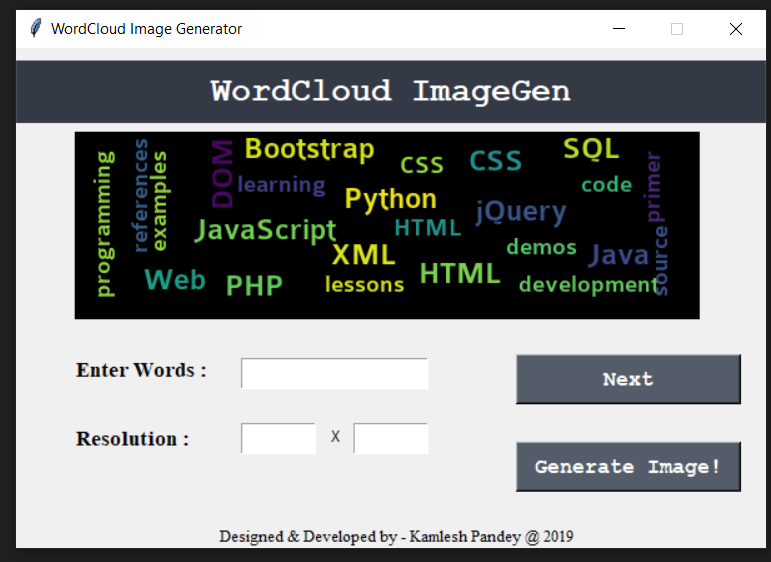
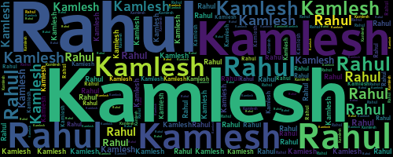

# Word-Cloud-Generator
  Word Cloud Generator in Python 3 with Tkinter UI.
  
# Requirements
  - WordcLoud and PIL Library.
  
# Usage 
  - Clone or Download this Repository.
  - Enter your desired words , one by one, eg->> write one word click next write another click next and so on as many you wish to.
  - Enter your desired Resolution of Resultant image.
  - Click on Generate Image.
  
# Credits
  
  - Created by Kamlesh Pandey. 
  
  
# Screenshots  
  

# Output Image

